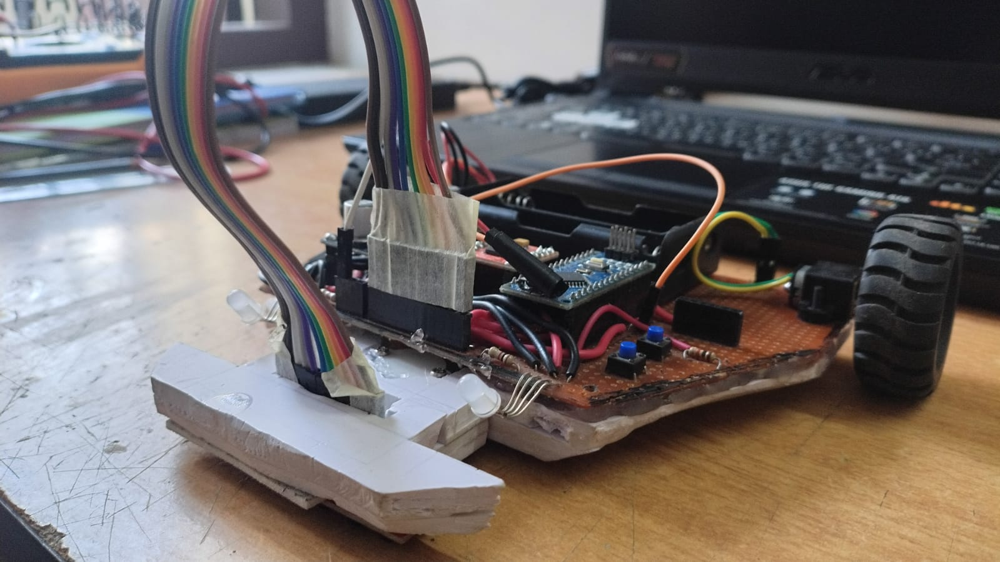
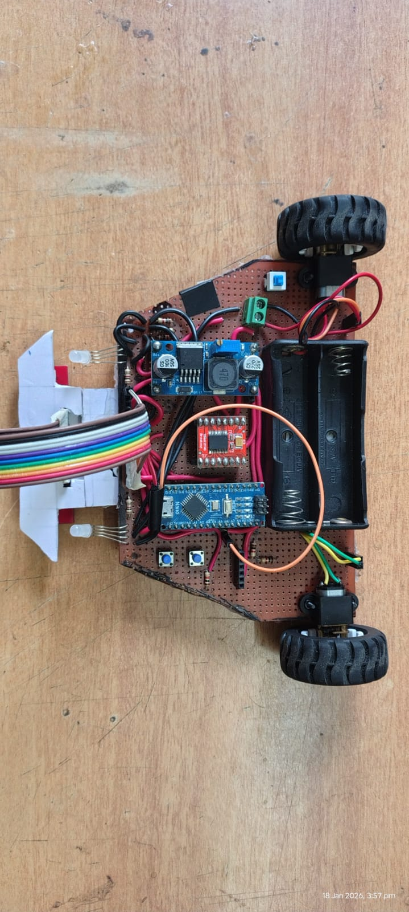

# 🏆 Line Follower Robot
**Model Engineering College — First Prize Winner**

## 📸 Images




Autonomous track navigation with a 9-checkpoint task sequence.

---

## ⚙️ Hardware

| Component | Details |
|---|---|
| Motor Driver | TB6612FNG |
| IR Sensor Array | QTR-8RC (8-channel) |
| Power | 2× Li-Ion Batteries + Buck Converter |
| Visual Indicator | RGB LED |

---

## 🗺️ Track Overview
```
S → CP2 → CP3 → CP4 → J → CP6 → CP7 → CP8 → FINAL
```

---

## ✅ Task Sequence

| # | Checkpoint | Action |
|---|---|---|
| 1 | Start box | Move straight through to begin the run |
| 2 | Checkpoint 2 | Detect and stop — hold position for 5 seconds |
| 3 | Checkpoint 3 | Turn on green LED — green zone begins |
| 4 | Checkpoint 4 | Turn off green LED — green zone ends |
| J | Junction (false trigger) | Identify junction, take left — skip optional loop |
| 6 | Checkpoint 6 | Execute full 360° in-place rotation, then continue forward |
| 7 | Checkpoint 7 | Begin reverse traversal — stop when next checkpoint detected |
| 8 | Checkpoint 8 | Reverse again — ignore next checkpoint, stop at subsequent one |
| F | Final checkpoint | Stop and blink red LED 5 times — run complete |

---

## 💡 RGB LED Behavior

| Color | Trigger | Meaning |
|---|---|---|
| 🟢 Green ON | Checkpoint 3 | Green zone active |
| ⚫ Green OFF | Checkpoint 4 | Green zone ends |
| 🔴 Red blink ×5 | Final checkpoint | Task complete |

---

## 🏆 Competition Result

**First Prize** — Roboroute Event  
📍 Model Engineering College, Kerala